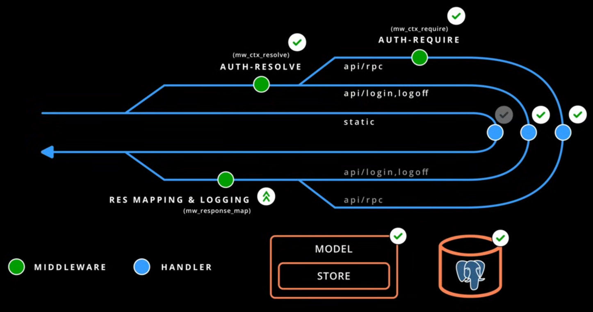
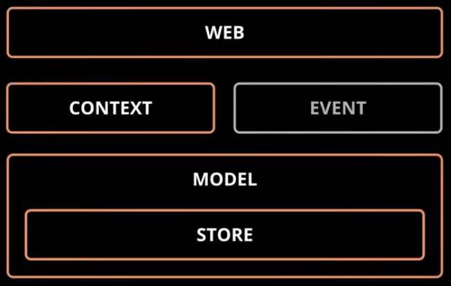

| Path      | Description |
|-----------|-------------|
| src/web   |
| src/ctx   | Context information that we get from the request.  |
| src/model | Consists of `ModelManager` and `ModelController`, used to interface with db. ModelManager holds the db pool connections. |

In Axum, there are 2 kinds of constructs:
- Handlers
- Middleware

`ctx_resolve` middleware is infallible. Meaning that, it will not fail, it will capture the error and put it in the request foo, but it will not going to fail.

`ctx_requrire` middleware will fail if error. This middleware is used in front of routes we need to make sure that they are authenticate.

