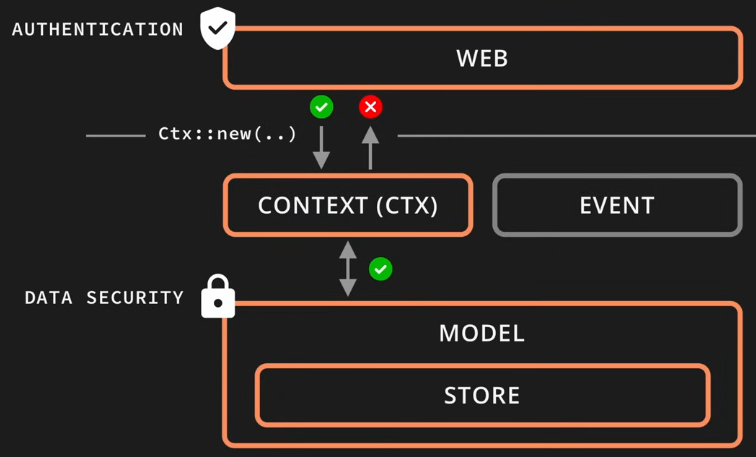

```bash
+---------------------+
|      WEB (IPC)      |
+----------+----------+
|  CONTEXT |   EVENT  |
+----------+----------+
|        MODEL        |
+---------------------+
|        STORE        |
+---------------------+
```

# Decoupling web layer and model layer
- Context is created by the web layer for the request, but context is decoupled from frameworks like Axum. 
- Hence, downstream users such as Model layer can use &Ctx without knowing about Axum.
- Implementing data security in the model layer will allow us to re-use for different web layers.



